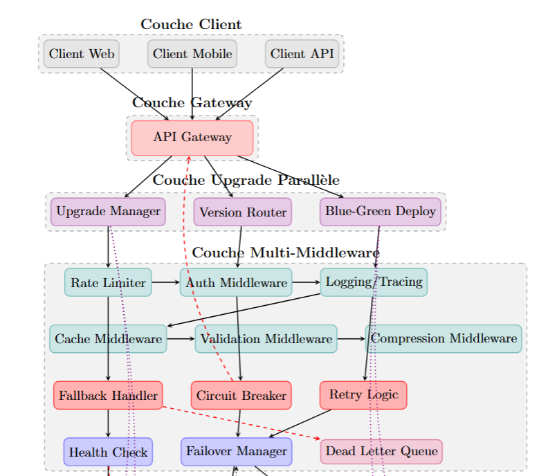

#  Analysis and Modeling of the DeepSeek Gateway Architecture with Fallback Middleware  

**Mariem Belhadj**  
**Nessim Zemzem**  

---

## Initial Architecture Diagram  

  

---

## 1️⃣ Overview of the Gateway Architecture  

### 🚪 API Gateway  
- Acts as the **single entry point** for all client requests.  
- Routes traffic to the appropriate microservices (Authentication, Users, Chat/Core AI).  
- Hides internal complexities from clients.  

### ⚖️ Load Balancers (Web & API)  
- Distribute requests across multiple service instances for **scalability** and **availability**.  
- **LB Web** handles front-end traffic.  
- **LB API** manages backend communication.  

### 🧩 Microservices Layer  
- Each service (Authentication, Users, Chat/Core AI, Models, Inference, Training, Monitoring) runs **independently**.  
- Ensures **modularity**, **fault isolation**, and **scalability**.  

### 🗄️ Databases 
- Every service has its **own database** (DB Auth, DB Users, DB Chat, DB Models, DB Training).  
- **Redis Cache** optimizes response times.  
- **Kafka Queue** ensures reliable asynchronous message passing.  

---

## 2️⃣ Analysis in Relation to Fallback Middleware

**Definition:** 

**Fallback middleware** intercepts failed or unavailable service calls at the API Gateway level, returning default or cached responses instead of propagating errors to the client.
- Prevents errors from propagating to clients by delivering **default responses** or **degraded modes**.  
- In DeepSeek’s case, critical operations like **inference** or **training requests** continue running even under failures.  
- **Failover Manager** redirects traffic to alternative services.  
- **Dead Letter Queue (DLQ)** stores failed messages for later recovery.    

---

## 3️⃣ Criticism of this API Gateway Architecture  

Although powerful, this design has weaknesses when fallback is handled only at the gateway:  

- ❌ **Over-reliance on the Gateway** → risks making it a performance bottleneck.  
- ❌ **Limited Context Awareness** → gateway cannot provide accurate **domain-specific fallbacks**.  
- ❌ **Middleware Complexity** → chaining retry, circuit breaker, and fallback makes debugging harder and increases latency.  
- ❌ **Scalability Risk** → as the number of services grows, maintaining fallback rules at the gateway becomes less efficient compared to **service-level fallbacks**.  

---
# 🔄 Upgrade to Parallel Microservices Architecture

In the new design, the **Upgrade Layer** is introduced between the **API Gateway** and the **Multi-Middleware Layer**. This layer enables smooth and zero-downtime upgrades of microservices.

---

## 🛠️ Upgrade Layer Components

- **Upgrade Manager**  → Orchestrates rolling upgrades of microservices.
- **Version Router**  → Routes requests to specific service versions (e.g., v1 vs v2) for canary releases or A/B testing.
- **Blue-Green Deployment**  → Runs two identical environments in parallel (Blue = current, Green = new). Traffic can be switched gradually, minimizing downtime.

 ==> This ensures seamless migration from older services to new ones without service interruptions, supporting zero-downtime deployment.

---

## ⚙️ Multi-Middleware Integration

The **Multi-Middleware Layer** provides resilience and observability across microservices:

- **Rate Limiter** → Controls request spikes.
- **Auth Middleware**  → Secures access.
- **Logging/Tracing**  → Ensures observability across distributed services.
- **Cache Middleware**  → Speeds up repeated queries.
- **Validation Middleware**  → Checks request payloads before hitting services.
- **Compression Middleware**  → Optimizes response sizes.
- **Fallback Handler**  → Provides degraded but functional responses in case of failure.
- **Circuit Breaker**  → Stops cascading failures.
- **Retry Logic**  → Automatically retries failed calls.
- **Failover Manager**  → Redirects traffic to alternative healthy nodes.
- **Dead Letter Queue**  → Stores unrecoverable failed requests.
- **Health Check**  → Monitors service readiness and liveness.

---

## 🔧 Adapting Fallback Configuration

Fallback must be carefully aligned with the multi-middleware workflow for optimal fault tolerance:

- **Cache + Fallback**: Serve cached responses (stale but available) if a downstream service fails before activating generic fallbacks.  
- **Validation + Fallback**: Invalid payloads trigger graceful fallback messages instead of service crashes.  
- **Circuit Breaker + Retry + Fallback**:  
  - Circuit breaker isolates failing services.  
  - Retry attempts recovery.  
  - If retries fail, fallback delivers degraded service results.  
- **Failover + Fallback**: Redirects traffic to another instance; if none is available, fallback ensures continuity.  
- **Logging/Tracing Integration**: All fallback events are logged for insights into recurring issues.

---

## 🚀 Why This Solution is Optimal

- **Zero-Downtime Upgrades**: Blue-Green + Version Router allow safe microservice migrations.  
- **Layered Resilience**: Multi-middleware ensures defense in depth (rate limiting, caching, retries, circuit breaking, fallback).  
- **Graceful Degradation**: Clients receive meaningful responses even under failures.  
- **Performance Efficiency**: Cache-first fallback reduces latency during outages.  
- **Observability & Recovery**: Logging, tracing, and DLQ enable fast debugging and replay of failed operations.
