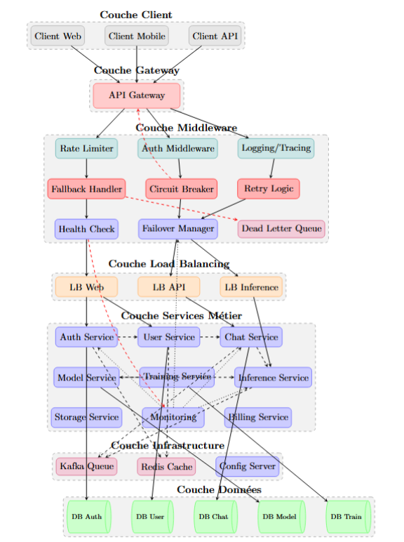
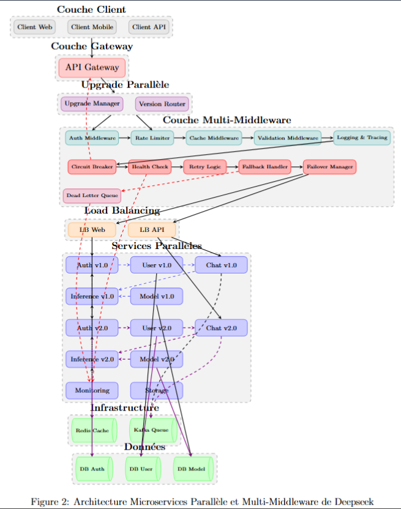

#  Analysis and Modeling of the DeepSeek Gateway Architecture with Fallback Middleware  

## 👨‍💻👩‍💻 Project Realized By

| Student Name |  Class |
|-------------------|----------|
| **Mariem Belhadj** | 3 IDL 2 |
| **Nessim Zemzem**  | 3 IDL 2 |

---

## Initial Architecture Diagram  

  

---

## 1️⃣ Overview of DeepSeek’s Initial Microservices Architecture 

The diagram illustrates **DeepSeek’s initial microservices architecture**, structured into several layers:

### 🧑‍💻 Client Layer
Contains **Web, Mobile, and API Clients** that send all requests through the API Gateway.

### 🚪 Gateway Layer
The **API Gateway** acts as the **single entry point** for all incoming requests.  
It routes traffic to the correct microservice (e.g., Authentication, User, Chat) while hiding internal complexity from clients.

### ⚖️ Load Balancing Layer
Three dedicated load balancers ensure scalability and availability:
- **LB Web** → handles front-end requests  
- **LB API** → manages backend communications  
- **LB Inference** → routes inference and AI workloads  

### 🧩 Service Layer
This layer includes independent, domain-specific services:
- **Auth Service**
- **User Service**
- **Chat Service**
- **Model Service**
- **Inference Service**
- **Training Service**
- **Monitoring Service**
- **Storage Service**
- **Billing Service**

Each service operates **independently**, promoting **modularity, fault isolation, and scalability**.

### 🏗️ Infrastructure & Data Layers
- **Infrastructure Components:**  
  - `Redis Cache` → optimizes response times  
  - `Kafka Queue` → manages asynchronous messaging  
  - `Config Server` → centralizes configuration  

- **Data Components:**  
  Each microservice has its own dedicated database:  
  - `DB Auth`, `DB User`, `DB Chat`, `DB Model`   

---

## 2️⃣ Analysis in Relation to Fallback Middleware

**Definition:** 

**Fallback middleware** intercepts failed or unavailable service calls at the API Gateway level, returning default or cached responses instead of propagating errors to the client.
- Prevents errors from propagating to clients by delivering **default responses** or **degraded modes**.  
- In DeepSeek’s case, critical operations like **inference** or **training requests** continue running even under failures.  
- **Failover Manager** redirects traffic to alternative services.  
- **Dead Letter Queue (DLQ)** stores failed messages for later recovery.    

---

## 3️⃣ Criticism of this API Gateway Architecture  

Although powerful, this design has weaknesses when fallback is handled only at the gateway:  

- ❌ **Over-reliance on the Gateway** → risks making it a performance bottleneck.  
- ❌ **Limited Context Awareness** → gateway cannot provide accurate **domain-specific fallbacks**.  
- ❌ **Middleware Complexity** → chaining retry, circuit breaker, and fallback makes debugging harder and increases latency.  
- ❌ **Scalability Risk** → as the number of services grows, maintaining fallback rules at the gateway becomes less efficient compared to **service-level fallbacks**.  

---
# 🔄 Upgrade to Parallel Microservices Architecture

In this new design, the **Upgrade Layer** is introduced between the **API Gateway** and the **Multi-Middleware Layer**.  
It enables **seamless, zero-downtime upgrades** of microservices and improves overall system resilience, scalability, and observability.

---

## 🛠️ Upgrade Layer Components

- **Upgrade Manager**  → Orchestrates rolling upgrades of microservices.
- **Version Router**  → Routes requests to specific service versions (e.g., v1 vs v2) for canary releases or A/B testing.
 ==> This ensures seamless migration from older services to new ones without service interruptions, supporting zero-downtime deployment.

---

## ⚙️ Multi-Middleware Integration

The **Multi-Middleware Layer** provides resilience and observability across microservices:

- **Rate Limiter** → Controls request spikes.
- **Auth Middleware**  → Secures access.
- **Logging/Tracing**  → Ensures observability across distributed services.
- **Cache Middleware**  → Speeds up repeated queries.
- **Validation Middleware**  → Checks request payloads before hitting services.
- **Fallback Handler**  → Provides degraded but functional responses in case of failure.
- **Circuit Breaker**  → Stops cascading failures.
- **Retry Logic**  → Automatically retries failed calls.
- **Failover Manager**  → Redirects traffic to alternative healthy nodes.
- **Dead Letter Queue**  → Stores unrecoverable failed requests.
- **Health Check**  → Monitors service readiness and liveness.

---

## 🔧 Adapting Fallback Configuration

Fallback must be carefully aligned with the multi-middleware workflow for optimal fault tolerance:

- **Cache + Fallback**: Serve cached responses (stale but available) if a downstream service fails before activating generic fallbacks.  
- **Validation + Fallback**: Invalid payloads trigger graceful fallback messages instead of service crashes.  
- **Circuit Breaker + Retry + Fallback**:  
  - Circuit breaker isolates failing services.  
  - Retry attempts recovery.  
  - If retries fail, fallback delivers degraded service results.  
- **Failover + Fallback**: Redirects traffic to another instance; if none is available, fallback ensures continuity.  
- **Logging/Tracing Integration**: All fallback events are logged for insights into recurring issues.

---

## 🚀 Why This Architecture is Optimal

- **✅ Zero-Downtime Upgrades** → Version Router and Blue-Green deployment enable seamless transitions.  
- **✅ Layered Resilience** → Multi-Middleware ensures protection through rate limiting, caching, circuit breaking, and fallback.  
- **✅ Parallel Service Versions** → Allow simultaneous old/new version coexistence for safer migrations.  
- **✅ Graceful Degradation** → Clients continue receiving meaningful responses even during partial failures.  
- **✅ Enhanced Observability** → Logging, tracing, and DLQ provide visibility and faster recovery.  
- **✅ Scalable and Maintainable** → Each layer is modular, making the architecture easier to evolve and optimize.

---

### 🧩 Summary

This **Parallel Microservices and Multi-Middleware Architecture** of DeepSeek represents a **resilient evolution** from the initial design.  
It eliminates the single-point bottleneck at the gateway, distributes fallback and resilience mechanisms, and enables **continuous delivery** with **fault-tolerant parallel service execution**.

---